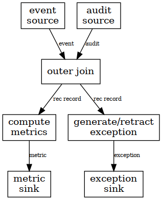

# Flink stream reconciliation

Flink job which reads an event stream and an audit stream and reconciles that all event IDs in the audit stream are present in the event stream.

Requirements:

* it must emit regular % *completeness metrics* every *o* minutes - both for the current time period and any previous periods which need adjusting
* it must emit a *missing* event when an ID is missing from the event stream within *n* minutes of the watermark
* it must emit a *found* event when an ID which has been reported as missing is found with *m* minutes of the watermark
* it will allow for *n* minutes of out-of-orderness in either stream
* it must deal with late events on both the event stream and the audit stream - late events with *m* minutes of the watermark should trigger an update to metrics, missing and found events.

So we have the following configurable time periods:

* *o* is the interval for metrics reporting (in event time)
* *n* is the time after which to report missing events (and the amount of out-of-orderness to allow) (in event time)
* *m* is the time period within which corrections can be made (and which determines state retention) (in event time)
* *z* is the **processing time** period to wait before starting to emit results if the event time watermark stops advancing.

### Design

#### Outer join

* 

### Implementation thoughts

Key control event stream on topic + source name + ID so that the join operator state is just 2 booleans.

Ideally events on the audit topic should not be batched - each audit event should be a separate event. If we do this it means the windowing of the metrics, timeliness of exceptions raised etc. can be completely configured in the reconciliation code. I can't think of any reasons the audit topic should be batchy (other than maybe it makes the next point a little easier).

Advantage of not batching reconciliation - streams can be partitioned by **topic** and **event ID** making the rec more horizontally scaleable that it would be if we reconciled abritrary batches of references.

If we re-emit a metric event for a time range it should **replace** the previous metric event. I.e. the time range for metric events must be deterministic.

Audit topic needs a schema definition. Should include as a minimum source event time timestamp, timestamp the event was emitted, event reference (to join on), source system name (name + ID must be unique) and possibly a text field for context/aid identification of break. Contract is the ID, system name, event time timestamp must be identical for matching events.

How to find the timestamp and reference in the event stream? Could either configure for each schema or could use Kafka headers and e.g. the CloudEvents spec.

Need to deal with **dupes**. Anything upstream assuming it can do idempotent writes will cause dupes. Maybe need configurable ability to ignore dupes within the *m* time period. (And possibly to emit dupe metrics?)

Need to deal with **filtering** and **splitting**. Filtering can be handled if the application emits no-op events for filtered inputs. Splitting (1 input topic, n output) can be built into the design of the reconciliation.

The join function needs to have a processing time timeout - if the audit or event topic stops for any reason (and therefore stops the watermark advancing) it needs to start generating metrics and exceptions after some configurable wall-clock time period. The [idle sources](https://ci.apache.org/projects/flink/flink-docs-stable/dev/event_timestamps_watermarks.html#dealing-with-idle-sources) feature will deal with idle partitions, not sure if it will stop the entire stream blocking progress. [This watermark assigner](https://github.com/aljoscha/flink/blob/6e4419e550caa0e5b162bc0d2ccc43f6b0b3860f/flink-streaming-java/src/main/java/org/apache/flink/streaming/api/functions/timestamps/ProcessingTimeTrailingBoundedOutOfOrdernessTimestampExtractor.java) has a processing time timeout - it is recommended by David Anderson on Stack.

Pattern should recommend sending **heartbeat messages** both on event and inventory message streams.

How to deal with aggregation, where lots of events -> a single projection. We could include a list of message IDs in the projection but it has the possibility to break if the list gets too long. If the source has the projection (like SSENG has all obligations) we could use that as a source of the IDs. Or we consider this out of scope and simply check that all events entered the projection.

Inventory messages are produced with a **role**. *Producer Expected*, *Consumer Expected* and *Actual*. The expected inventories would only come from external sources/sinks, the actual would be generated by reading topics. Configuration is needed to associate inventories for reconciliation.
